# 🌟 Social Media Platform - Frontend

A modern, responsive social media application built with React, TypeScript, and Tailwind CSS. This frontend provides a Twitter-like interface with real-time interactions, image uploads, and user authentication.

## 📸 Screenshots

### 🏠 Home Feed
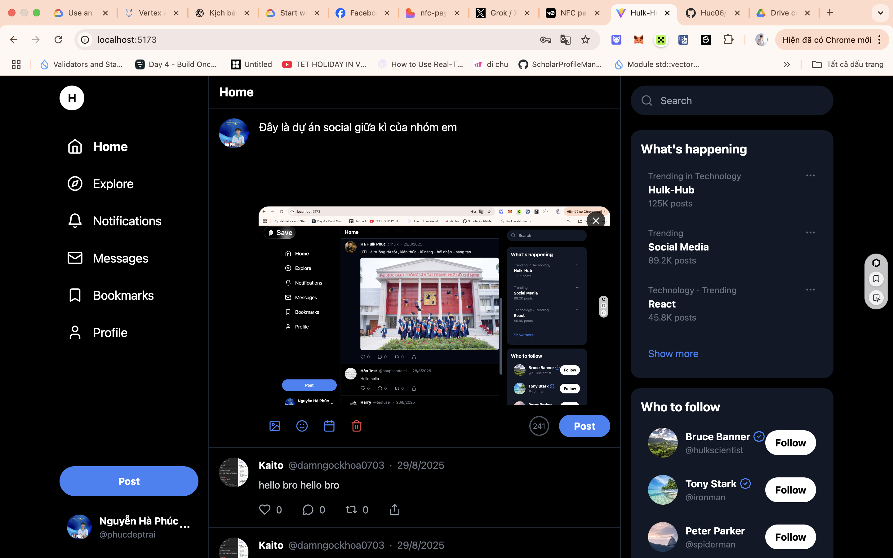
*Main timeline showing posts from all users with modern Twitter-like interface*

### ✍️ Post Creation
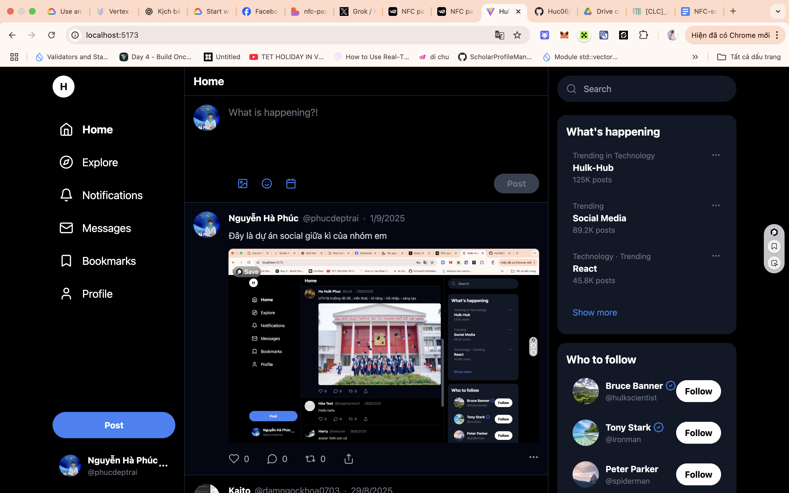
*Post composer with image upload functionality and rich text editing*

### 👤 User Profile
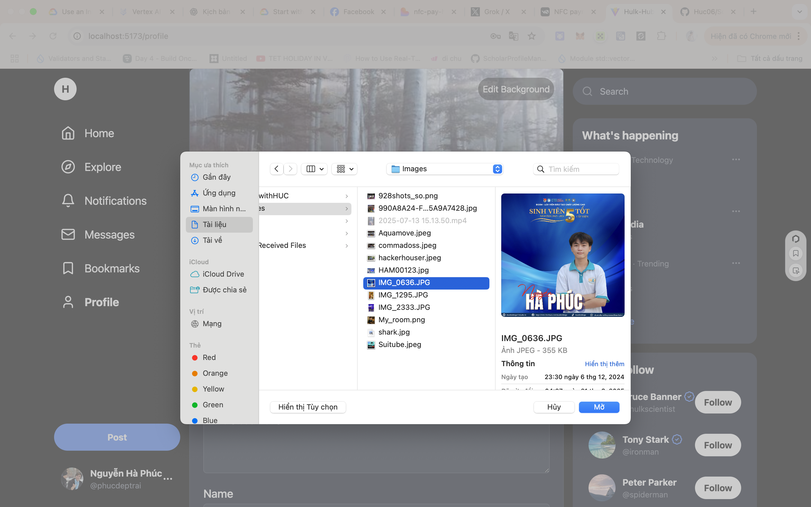
*User profile page with customizable avatar and personal information*

### 📝 Profile Editing
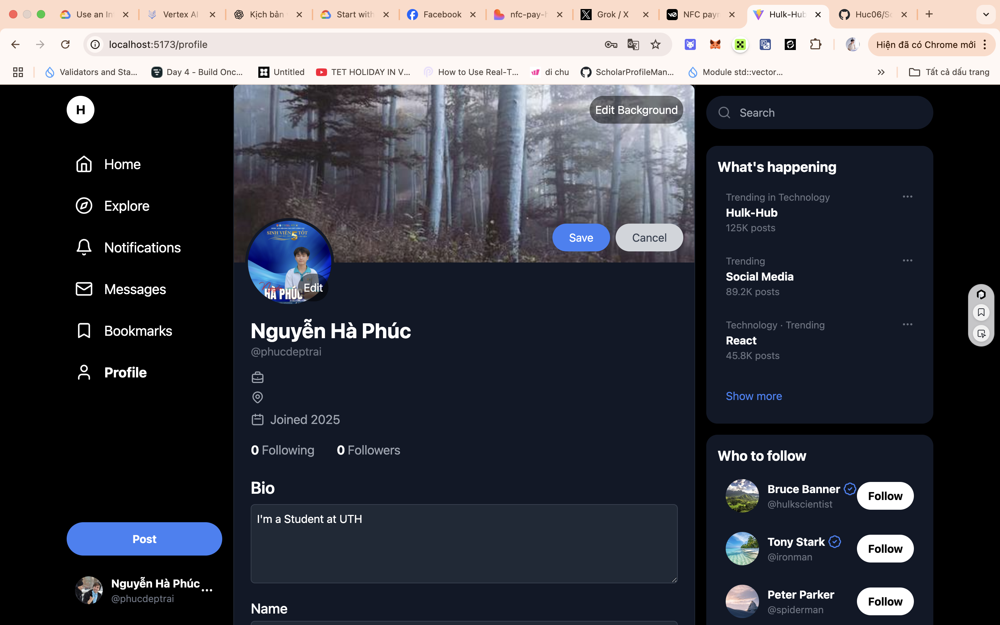
*Profile editing interface with bio, location, and personal details*

### 🔐 Authentication
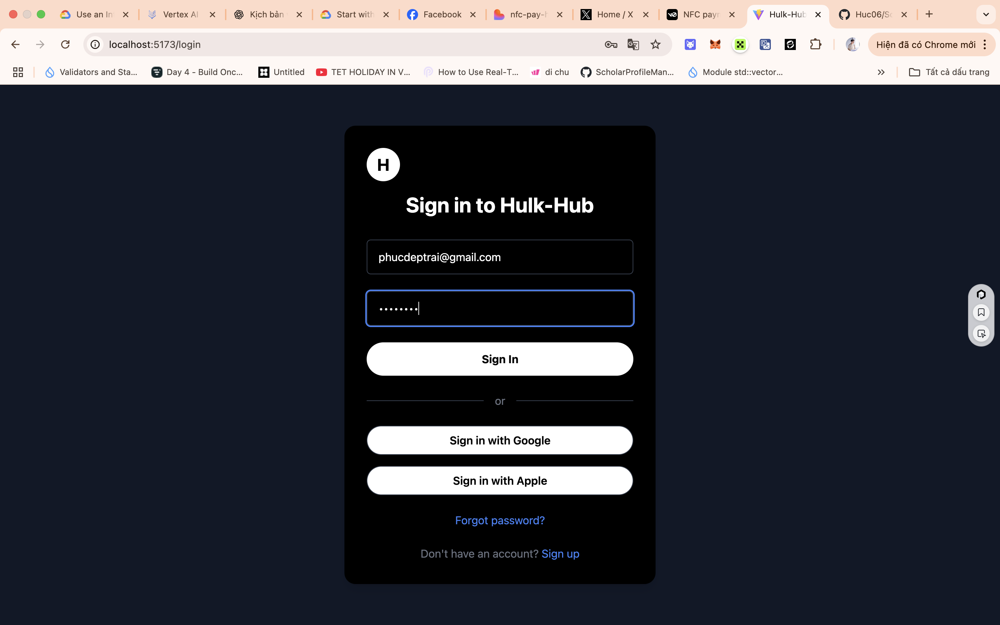
*User login page with clean, modern design*

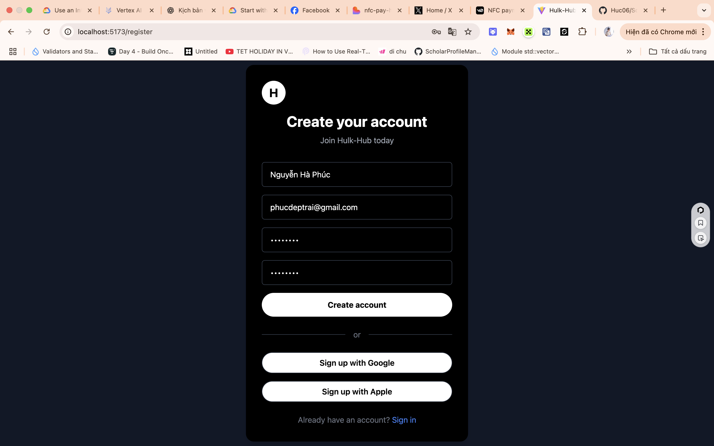
*User registration page with form validation*

### 📚 Bookmarks
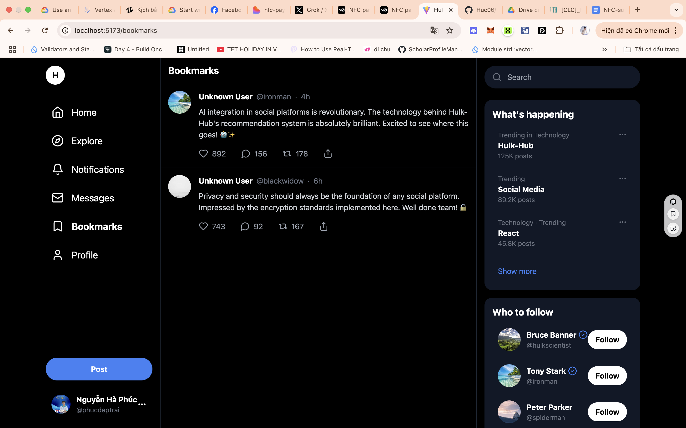
*Bookmarked posts and saved content management*

### 🔍 Explore
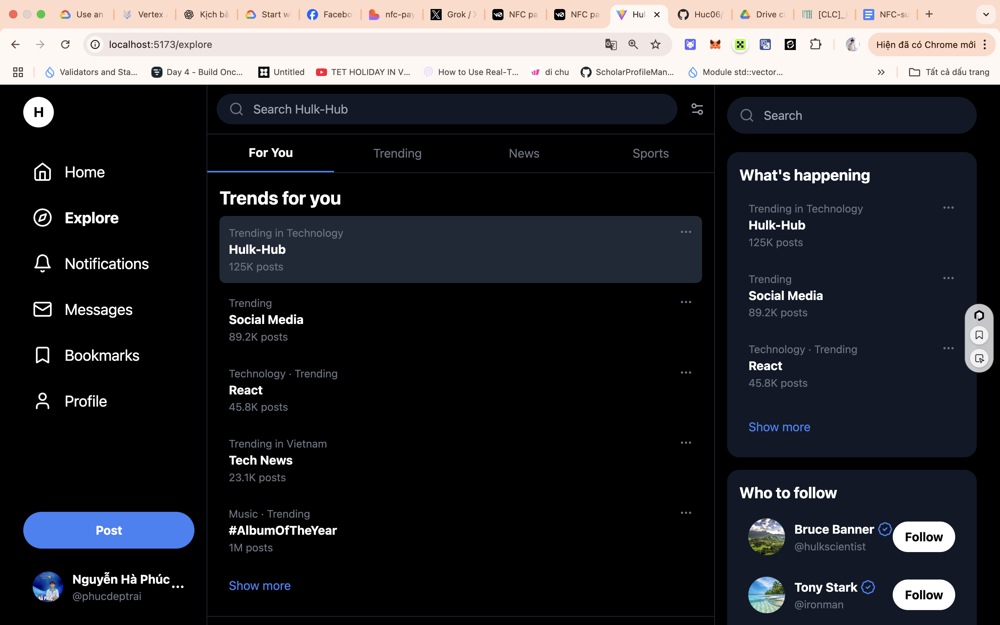
*Discover new content and trending topics*

### 💬 Messages
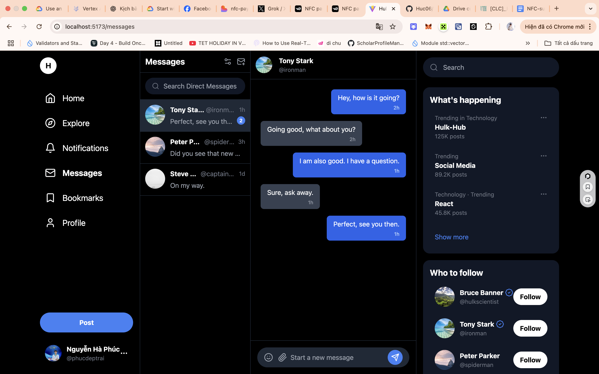
*Direct messaging interface*

### 🔔 Notifications
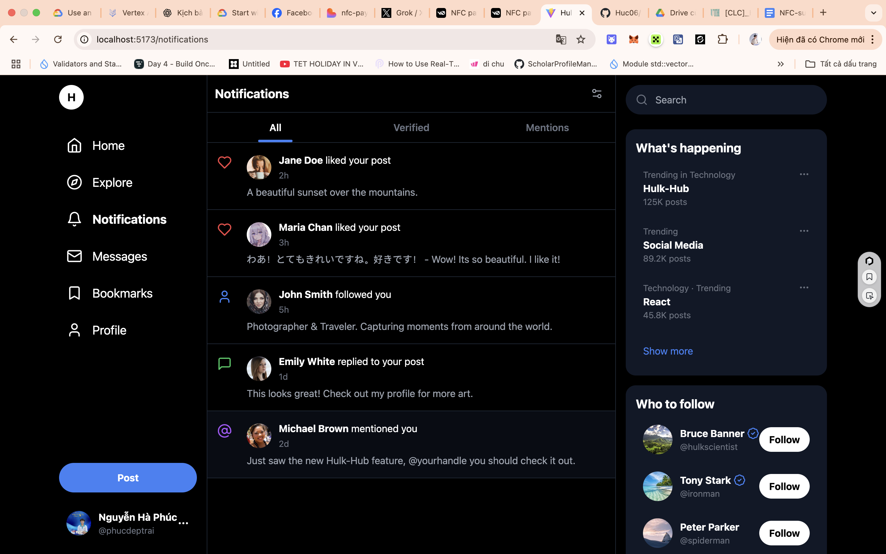
*Real-time notifications and activity feed*

### 🏫 UTH Integration
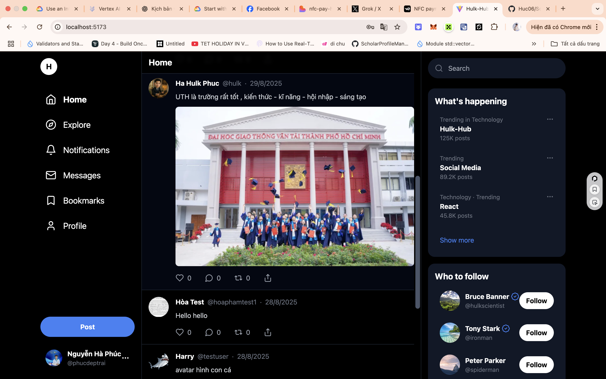
*University of Technology Ho Chi Minh City integration*

### 🎨 Background Customization
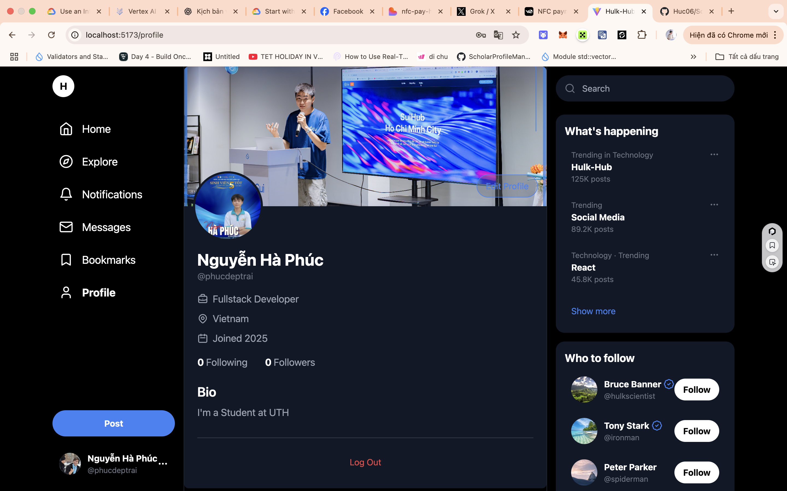
*Customizable profile background images*

### 📍 Location Services
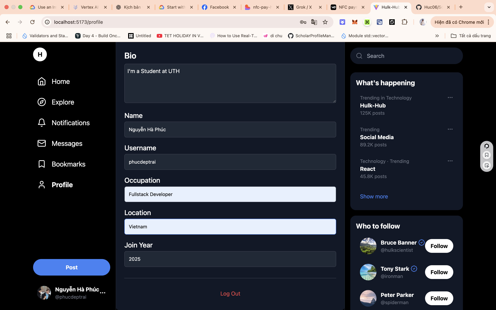
*Location-based features and services*

## 🚀 Features

### ✨ Core Features
- **📱 Responsive Design**: Mobile-first approach with Tailwind CSS
- **🔐 User Authentication**: Secure login/register with JWT tokens
- **📝 Post Creation**: Create posts with text and image support
- **🖼️ Image Upload**: Cloudinary integration for image storage
- **👥 User Profiles**: Customizable profiles with avatars and backgrounds
- **🔄 Real-time Updates**: React Query for efficient data fetching
- **📱 Modern UI**: Clean, Twitter-inspired interface

### 🛠️ Technical Features
- **TypeScript**: Full type safety across the application
- **React Query**: Efficient data fetching and caching
- **React Router**: Client-side routing and navigation
- **Tailwind CSS**: Utility-first CSS framework
- **Vite**: Fast build tool and development server
- **Error Handling**: Comprehensive error handling and user feedback
- **Toast Notifications**: User-friendly notification system

## 🏗️ Architecture

```
src/
├── components/          # Reusable UI components
│   ├── Post.tsx        # Post display component
│   ├── PostComposer.tsx # Post creation component
│   ├── Timeline.tsx    # Timeline display
│   ├── Sidebar.tsx     # Navigation sidebar
│   ├── RightSidebar.tsx # Right sidebar with suggestions
│   └── ...
├── pages/              # Page components
│   ├── Home.tsx        # Home feed page
│   ├── Profile.tsx     # User profile page
│   ├── Login.tsx       # Authentication pages
│   ├── Register.tsx    # User registration
│   └── ...
├── services/           # API service layer
│   ├── api.ts         # Base API configuration
│   ├── auth.service.ts # Authentication services
│   ├── posts.service.ts # Post management
│   └── ...
├── hooks/              # Custom React hooks
├── contexts/           # React contexts
├── types/              # TypeScript type definitions
└── lib/                # Utility functions
```

## 🛠️ Tech Stack

### Frontend
- **React 18** - UI library
- **TypeScript** - Type safety
- **Vite** - Build tool
- **Tailwind CSS** - Styling
- **React Query** - Data fetching
- **React Router** - Navigation
- **React Hot Toast** - Notifications
- **Lucide React** - Icons

## 🚀 Getting Started

### Prerequisites
- Node.js (v18 or higher)
- npm or pnpm

### Installation

1. **Clone the repository**
   ```bash
   git clone https://github.com/Huc06/Social_project.git
   cd Social_project
   ```

2. **Install dependencies**
   ```bash
   npm install
   # or
   pnpm install
   ```

3. **Environment Setup**
   Create a `.env` file in the root directory:
   ```env
   VITE_API_BASE_URL=http://localhost:4000/api/v1
   ```

4. **Start the development server**
   ```bash
   npm run dev
   # or
   pnpm dev
   ```

The application will start on `http://localhost:5173`

## 📱 Usage

### Authentication
1. Register a new account or login with existing credentials
2. JWT tokens are automatically managed for session persistence

### Creating Posts
1. Click the compose button on the home page
2. Write your post content
3. Optionally upload an image
4. Click "Post" to publish

### Profile Management
1. Navigate to your profile
2. Upload avatar and background images
3. Edit your bio and personal information

### Navigation
- **Home**: View timeline of all posts
- **Explore**: Discover trending content
- **Bookmarks**: View saved posts
- **Messages**: Direct messaging
- **Notifications**: Activity updates
- **Profile**: Manage your profile

## 🔧 Available Scripts

```bash
npm run dev          # Start development server
npm run build        # Build for production
npm run preview      # Preview production build
npm run lint         # Run ESLint
```

## 📦 Build & Deployment

### Development Build
```bash
npm run dev
```

### Production Build
```bash
npm run build
```

### Preview Production Build
```bash
npm run preview
```

### Deploy to Vercel/Netlify
```bash
npm run build
# Deploy dist/ folder to your hosting platform
```

## 🎨 Design System

### Color Palette
- **Primary**: Blue tones for main actions
- **Secondary**: Gray tones for secondary elements
- **Success**: Green for positive actions
- **Warning**: Yellow for warnings
- **Error**: Red for errors

### Typography
- **Headings**: Bold, clear hierarchy
- **Body**: Readable, comfortable line height
- **Code**: Monospace for technical content

### Components
- **Buttons**: Consistent styling and hover states
- **Forms**: Clear validation and error states
- **Cards**: Clean, modern post cards
- **Navigation**: Intuitive sidebar and top navigation

## 🔒 Security Features

- **JWT Authentication**: Secure token-based authentication
- **Input Validation**: Client-side form validation
- **XSS Protection**: React's built-in XSS protection
- **HTTPS**: Secure communication with backend
- **Environment Variables**: Sensitive data protection

## 📱 Responsive Design

The application is fully responsive and optimized for:
- **Desktop**: 1920x1080 and above
- **Tablet**: 768x1024
- **Mobile**: 375x667 and above

## 🧪 Testing

```bash
# Linting
npm run lint

# Build testing
npm run build
npm run preview
```

## 🤝 Contributing

1. Fork the repository
2. Create a feature branch (`git checkout -b feature/amazing-feature`)
3. Commit your changes (`git commit -m 'Add amazing feature'`)
4. Push to the branch (`git push origin feature/amazing-feature`)
5. Open a Pull Request

## 📄 License

This project is licensed under the MIT License - see the [LICENSE](LICENSE) file for details.

## 👥 Team

- **Frontend Development**: React + TypeScript
- **UI/UX Design**: Modern, responsive interface
- **State Management**: React Query integration
- **Styling**: Tailwind CSS implementation

## 🔮 Future Enhancements

- [ ] Real-time notifications
- [ ] Post likes and comments
- [ ] User following system
- [ ] Advanced search functionality
- [ ] Dark mode theme
- [ ] PWA support
- [ ] Offline functionality

## 📞 Support

If you have any questions or need help, please:
- Open an issue on GitHub
- Contact the development team
- Check the documentation

---

**Made with ❤️ by the development team**

*Last updated: January 2025*
